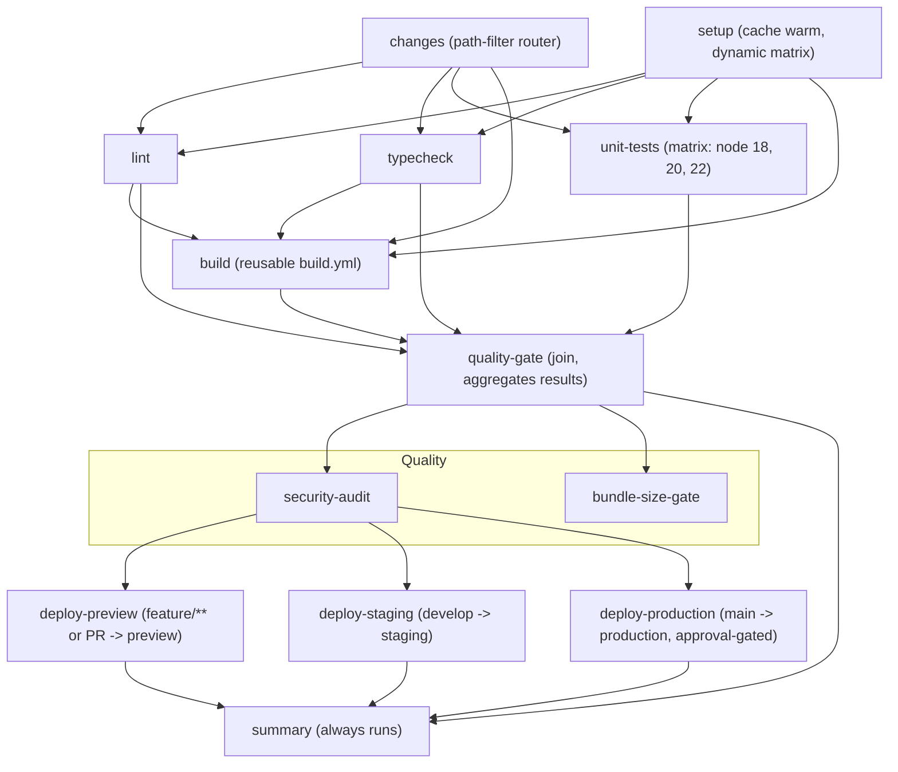

# React Jeopardy

A Jeopardy-style quiz about React. Pick a category and a dollar value, read the clue, respond in the form of a question, and score. Built with React + TypeScript + Vite as a fully static app so it deploys straight to GitHub Pages, fronted by a deliberately branchy GitHub Actions pipeline.

## The board

Six categories, five clues each ($200 to $1000, easy to hard):

- **Hook, Line & Sinker** - the core hooks
- **Side Effects May Include** - effects done right and wrong
- **Render & Prejudice** - rendering, reconciliation, keys, memo
- **The Suspense Is Killing Me** - Suspense, lazy, transitions, error boundaries
- **Server, Please** - Server Components, SSR, the React Compiler
- **Community Chest** - the FAQs and gotchas from r/reactjs and dev.to

Every clue carries a `source` tag mapping it to one of six areas the content is derived from: react.dev **Learn**, **Reference**, **Community**, and **Blog**, plus **dev.to/t/react** and **reddit.com/r/reactjs**. Clues are original, written in the Jeopardy answer/question format and grounded in the React topics those sources cover (not copied verbatim).

## Play

Choose **1 to 4 players** on the setup screen. Players take turns: click a cell to open its clue, hit **Reveal answer** to see the correct "What is ...?" response, then mark the current player **Correct** (+value, keep control) or **Wrong** (-value, turn passes). **Skip** passes the turn without scoring. When the board is cleared the highest score wins (ties are called). Start a **New game** any time.

## Develop

```bash
npm install
npm run dev        # local dev server (Vite)
npm run typecheck  # tsc --noEmit
npm run lint       # eslint (incl. react-hooks rules)
npm test           # vitest (pure game logic + dataset validation)
npm run build      # typecheck + production bundle into dist/
```

Game logic lives in `src/game/` and is split so the interesting parts are unit-tested with no DOM:

- `questions.ts` - the 30-clue board dataset with source tags
- `engine.ts` - the pure reducer (select, reveal, answer, close, reset) and scoring
- `types.ts` - shared types
- `App.tsx` and `src/components/` - the React UI (Board, ClueModal, Scoreboard)

The dataset is validated by tests (6 categories, 5 ascending values each, question-form responses, every source represented) so the board stays well-formed as clues are added.

## CI/CD pipeline

One orchestrator (`ci.yml`), one composite action, and three reusable workflows (`build.yml`, `quality.yml`, `deploy.yml`). Triggers on pushes to `main`, `develop`, and `feature/**`, on pull requests, and manually.



### Branch flows (environment promotion + auto-promotion)

Branches route to different GitHub Environments through the same reusable `deploy.yml`:

| Trigger | Environment | Deploy |
|---------|-------------|--------|
| `feature/**` push or any pull request | `preview` | simulated, per-PR/branch URL |
| push to `develop` | `staging` | simulated staging URL |
| push to `main` | `production` | real GitHub Pages deploy, gated by the environment's protection rule |

A separate workflow, `promote.yml`, watches the CI workflow via `workflow_run` on `develop`; when CI passes it opens (or leaves in place) a `develop -> main` promotion PR. Merging that PR into `main` triggers the production deploy.

**Two manual setup steps** (can't be expressed in YAML):
- Repo Settings, then Environments, create `production` and add required reviewers so the `deploy-production` job pauses for approval.
- Settings, then Actions, General, enable "Allow GitHub Actions to create and approve pull requests" so `promote.yml` can open the promotion PR.

### Approval-gated integration-test fork

Pull requests fan out into two parallel gates: the fast static checks (`lint`, `typecheck`, `unit-tests`) and an `integration-test` job that pauses for manual approval before it runs. The gate is the `integration-test` **environment's required-reviewers** rule (Settings, then Environments, create `integration-test` with required reviewers).

This deliberately runs on the ordinary `pull_request` event, not `pull_request_target`. `pull_request_target` would give the job repo secrets and a write token while checking out untrusted PR code, which can leak secrets; `pull_request` keeps a read-only token so the approval-gated fork stays safe.

**Pages caveat:** GitHub Pages hosts one site per repo, so only `production` is a real Pages deploy. `preview` and `staging` publish the same build artifact and record an environment URL (simulated) to exercise the branch routing and protection rules without extra infra.

Highlights: a path-filter router lets doc/CI-only PRs skip the code branches (the join tolerates skipped branches); `setup` emits a dynamic test matrix consumed with `fromJSON`; static checks fan out in parallel and rejoin at `quality-gate`; three reusable sub-workflows run as nested DAGs (`quality.yml` itself forks into audit + bundle-size); branch routing sends `feature/**`/PRs to `preview`, `develop` to `staging`, and `main` to the approval-gated `production` Pages deploy; a cross-workflow `promote.yml` opens the `develop -> main` PR on green; and a final `always()` summary posts a result table.

## Deploy to GitHub Pages

1. Push to `main`.
2. Repo Settings, then Pages, set Source to GitHub Actions.
3. The `deploy-production` job publishes `dist/` on every push to `main` (after the `production` environment approval). Vite is configured with `base: "./"` so assets resolve from the project subpath.

Served at `https://<owner>.github.io/webmaster/`.
